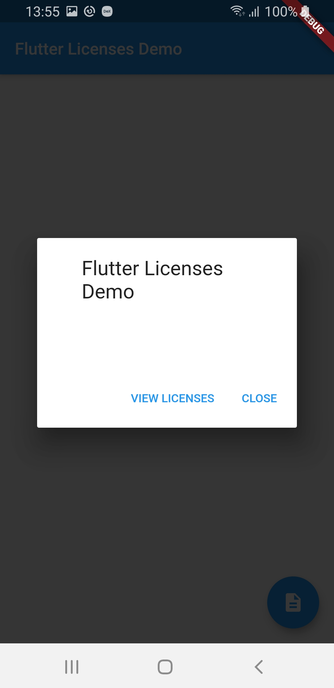
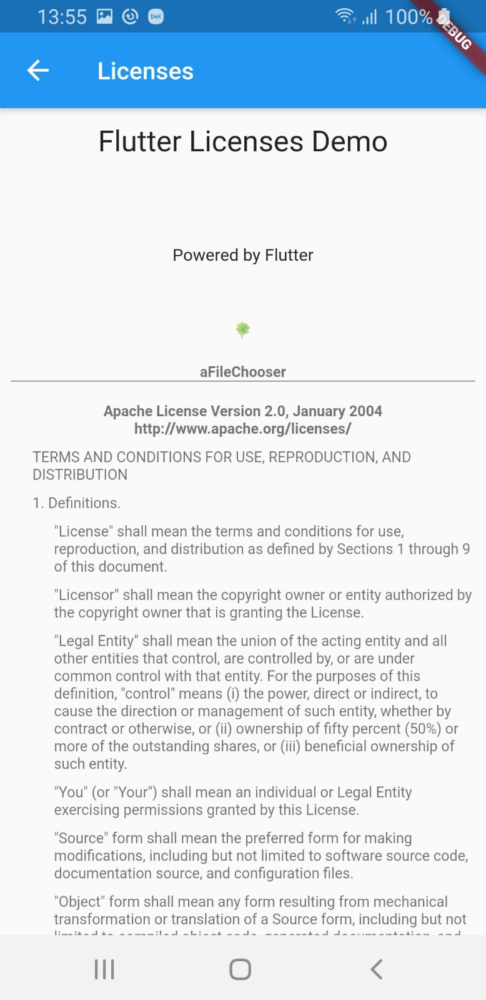

# Flutter Licenses Demo

A dome app that shows how to present the licenses in the app.
Demo includes 2 modes, with About section and plain Licenses view.

Flutter documentation can be foind here:
 - [LicenseRegistry](https://api.flutter.dev/flutter/foundation/LicenseRegistry-class.html)
 - [LicensePage](https://api.flutter.dev/flutter/material/LicensePage-class.html)

## Usage

### To present the About dialog just:

```
showAboutDialog(context: context)

```




### To present the Licenses view just:

```
showLicensePage(context: context)

```



## Authors

* **devzeze** -[GitHub](https://github.com/devzeze)
